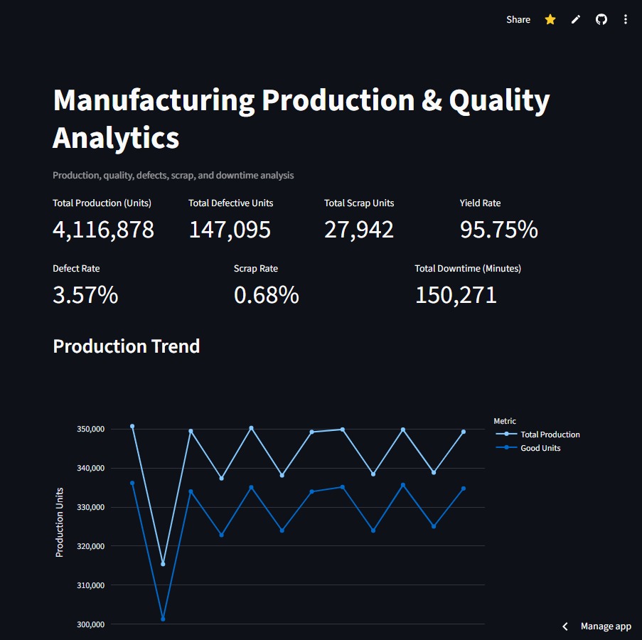
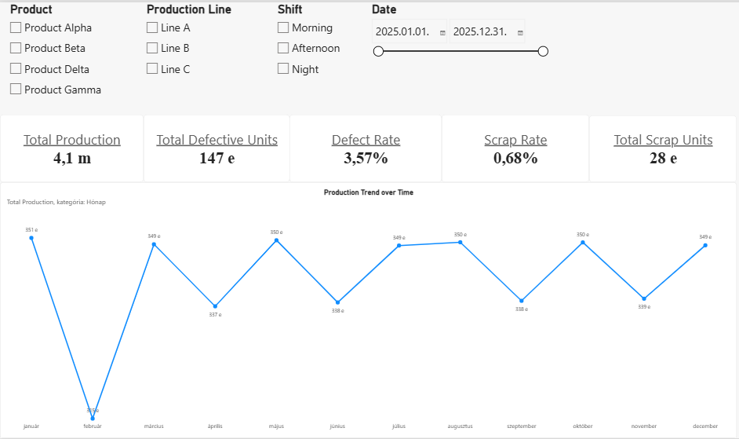

# Manufacturing Production & Quality Analytics

An end-to-end manufacturing data analytics portfolio project focused on production performance, product quality, defects, scrap, downtime, and operational performance.

The project demonstrates a complete analytics workflow from raw manufacturing data through data cleaning, validation, exploratory analysis, SQL analytics, Power BI reporting, and an interactive Streamlit application.

---

## 🚀 Live Demo

**Interactive Streamlit dashboard:**  
https://manufacturing-quality-analytics.streamlit.app

The live dashboard is connected to a cloud PostgreSQL database hosted on Supabase and provides interactive production, quality, scrap, downtime, product, line, and shift analysis.

**Source code:**  
https://github.com/Theofil87/manufacturing-production-quality-analytics

---

## Architecture

The project implements an end-to-end manufacturing analytics pipeline:

```text
Raw Manufacturing CSV
        │
        ▼
Python / Pandas
Cleaning & Validation
        │
        ▼
Processed Manufacturing Data
        │
        ▼
PostgreSQL / Supabase
        │
        ▼
SQL Analytical Views
        │
        ├──────────────────────┐
        ▼                      ▼
    Power BI              Streamlit
    Dashboard             Dashboard
        │                      │
        └──────────┬───────────┘
                   ▼
          Manufacturing KPIs
          & Operational Insights
```

### Analytics layers

| Layer | Purpose |
|---|---|
| **Python / Pandas** | Cleaning, validation, derived fields |
| **PostgreSQL / SQL** | Central analytical data layer and reusable views |
| **Power BI / DAX** | Business intelligence and management reporting |
| **Streamlit / Plotly** | Interactive web-based analytics |
| **Supabase** | Cloud PostgreSQL hosting |
| **GitHub** | Version control and portfolio documentation |

The same KPI definitions and business rules are used across the SQL, Power BI, and Streamlit layers to maintain analytical consistency.

---

## 📊 Dashboard Preview

### Streamlit Dashboard

The live Streamlit dashboard provides:

- KPI overview
- Production and quality trends
- Production by line and shift
- Defect and scrap analysis
- Downtime analysis
- Line × Shift performance
- Interactive filters

**Live Demo:** https://manufacturing-quality-analytics.streamlit.app



### Power BI Dashboard

The Power BI report contains four analytical pages:

- Executive Overview
- Production & Quality
- Line × Shift Performance
- Shift Performance

The Power BI project files are available in the `powerbi/` directory.



---

---

## Project Overview

Manufacturing operations generate large amounts of production and quality data. This project demonstrates how these data can be transformed into actionable analytical insights.

The analysis focuses on:

- Production volume
- Production quality
- Defect rates
- Scrap rates
- Yield
- Downtime
- Production line performance
- Shift performance
- Product performance
- Line × Shift interactions
- Trends over time
- Data reconciliation and validation

The project is designed as a portfolio example for manufacturing data analytics and operational intelligence.

---

## Business Questions

The project addresses the following business questions:

### Production

- How much is being produced?
- How does production volume change over time?
- Which production lines have the highest production volume?
- Which products contribute most to production?

### Quality

- What is the overall defect rate?
- How does defect rate differ between production lines?
- How does defect rate differ between products and shifts?
- What are the major defect categories?

### Scrap

- What is the overall scrap rate?
- How does scrap rate vary by product and shift?
- Which products generate higher scrap levels?

### Downtime

- How much production downtime is recorded?
- What are the main downtime reasons?
- How does downtime change over time?
- How does downtime vary across production lines and shifts?

### Operational Performance

- How does performance differ between production lines?
- How does shift performance vary?
- Are there meaningful differences between Line × Shift combinations?

---

## Technology Stack

- Python
- Pandas
- NumPy
- SciPy
- Jupyter Notebook
- SQL
- PostgreSQL 18
- SQLAlchemy
- Power BI
- DAX
- Power Query
- Plotly
- Streamlit
- GitHub
- VS Code

```text
Raw CSV
  |
  v
Python / Pandas cleaning
  |
  v
Cleaned CSV
        |
        v
PostgreSQL
        |
  v
SQL analytical views
  |
  +----------------------+
  |                      |
  v                      v
    Power BI              Streamlit
    Dashboard             Dashboard
```

Jupyter / EDA uses the cleaned CSV for exploratory analysis, while PostgreSQL is
the production analytics layer used by both reporting applications.

Dataset

The processed dataset contains 3,285 manufacturing production records.

Key fields include:

- record_id
- date
- shift
- production_line
- product
- production_quantity
- defective_units
- scrap_units
- downtime_minutes
- defect_category
- downtime_reason
- good_units
- defect_rate
- scrap_rate

The raw and processed datasets are stored separately to maintain a clear data-processing workflow.

Data Cleaning & Validation

The Python data-processing pipeline performs several validation steps before the dataset is used for analytics.

Validation includes:

- Required column validation
- Missing-value checks
- Numeric data type validation
- Production quantity validation
- Defective unit validation
- Scrap unit validation
- Downtime validation
- Good unit calculation
- Defect rate calculation
- Scrap rate calculation
- Production reconciliation

The processing pipeline reports successful completion only after the validation checks pass.

Data Reconciliation

Good Units, Defective Units, and Scrap Units are treated as mutually exclusive categories.

Therefore:

Production Quantity
=
Good Units
+
Defective Units
+
Scrap Units

The reconciliation gap is calculated as:

Production
- Good Units
- Defective Units
- Scrap Units

A reconciliation gap of zero indicates that production quantities are fully reconciled.

This validation is implemented in Power BI using:

- Reconciliation Gap
- Reconciliation Status

These measures are used as data-quality controls rather than primary business KPIs.

Downtime Business Rule

The source data contains records where downtime_reason is missing.

The analysis identified that these records correspond to downtime below 15 minutes.

Therefore, missing downtime reasons are intentionally represented in the analytical layer as:

No Reason Recorded

This preserves the distinction between:

- a recorded downtime reason
- downtime where no reason was recorded

The transformation is implemented through the downtime_reason_clean field.

Key KPIs

The Power BI semantic model and Streamlit dashboard use the same validated KPI
definitions:

- Total Production
- Total Defective Units
- Total Scrap Units
- Defect Rate
- Scrap Rate
- Yield Rate
- Total Downtime Minutes
- KPI Definitions

Defect Rate

        Total Defective Units / Total Production

Scrap Rate

        Total Scrap Units / Total Production

Yield Rate

        Good Units / Total Production

Total Downtime

        SUM(Downtime Minutes)

Rates are calculated from aggregated quantities rather than averaging row-level percentages.

PostgreSQL Analytical Layer

PostgreSQL 18 provides the production analytics and reusable reporting layer.
The SQL implementation contains 12 reusable analytical views covering the
production base, monthly trends, line, shift, product, defect, scrap, downtime,
line × shift, and reconciliation analyses.

The analytical layer is responsible for:

- Aggregated KPI calculations from unit totals
- Defect, scrap, and yield rate definitions
- Downtime reason normalization to `No Reason Recorded`
- Explicit shift ordering using Morning, Afternoon, and Night
- Production reconciliation and reconciliation status
- Reusable datasets for Power BI and Streamlit

The views are defined in `sql/03_create_views.sql` and queried by the analysis
scripts in `sql/04_kpi_analysis.sql` and `sql/05_production_quality_analysis.sql`.

Power BI and Streamlit use these same validated business definitions so that KPI
values, rates, downtime handling, shift ordering, and reconciliation results are
consistent across both applications.

Exploratory Data Analysis

The Jupyter Notebook contains exploratory analysis covering:

- Dataset structure
- Missing values
- Production volume
- Production line performance
- Defect rates
- Shift performance
- Normalized downtime analysis
- Defect category Pareto analysis
- Downtime reason analysis
- Product performance
- Line × Shift analysis
- Time-based trends
- Data-driven observations and limitations

The EDA is descriptive and focuses on identifying patterns rather than making unsupported causal claims.

Streamlit Dashboard

The Streamlit dashboard is PostgreSQL-backed and uses SQLAlchemy for database
connections and Plotly for interactive visualizations. PostgreSQL is the primary
data source; the cleaned CSV is no longer the primary Streamlit source.

The dashboard includes:

- Seven KPI cards: Total Production, Total Defective Units, Total Scrap Units, Yield Rate, Defect Rate, Scrap Rate, and Total Downtime
- Monthly production and quality trends
- Production by line and shift
- Defect rate by line and product
- Scrap rate by product
- Downtime by reason
- Line × Shift performance
- Section-specific production line, shift, and product filters

Database reads use Streamlit caching, and the application provides explicit
connection and empty-result handling for local PostgreSQL execution.

Power BI Dashboard

The Power BI report contains four analytical pages.

1. Executive Overview

Provides a high-level view of manufacturing performance.

Includes:

- Total Production
- Total Defective Units
- Total Scrap Units
- Defect Rate
- Scrap Rate
- Yield Rate
- Production Trend over Time
- Product slicer
- Production Line slicer
- Shift slicer
- Date range slicer

2. Production & Quality

Focuses on production, quality, product performance, and downtime.

Includes:

- Production by Production Line
- Defect Rate by Production Line
- Total Downtime Minutes by Reason
- Defect Rate by Product
- Scrap Rate by Product

3. Line × Shift Performance

Analyzes the interaction between production lines and shifts.

Includes:

- Production by Line and Shift
- Defect Rate by Line and Shift
- Scrap Rate by Line and Shift
- Defect Rate Trend over Time
- Scrap Rate Trend over Time
- Total Downtime Trend over Time

4. Shift Performance

Provides a focused comparison of manufacturing shifts.

Includes:

- Production by Shift
- Defect Rate by Shift
- Scrap Rate by Shift

Shift order is explicitly controlled using:

Morning
Afternoon
Night

Power BI Data Model

The Power BI model uses a simple structure centered around the processed manufacturing production table.

Key characteristics:

- Import mode
- Single primary manufacturing fact table
- Power BI date table
- Date relationship
- Explicit DAX measures
- Power Query transformations
- Dedicated shift sorting column

The model intentionally remains relatively simple because the current dataset does not require a complex dimensional model.

Power Query Transformations

Power Query performs final semantic-layer transformations including:

- Data type corrections
- Shift sort-order creation
- Downtime numeric conversion
- Locale-aware numeric conversion
- Missing downtime reason handling
- Final column type cleanup

downtime_minutes is converted using the appropriate locale because the source CSV uses a period as the decimal separator.

Data Quality Controls

The project includes several data-quality controls:

- Required column validation
- Numeric type validation
- Production quantity validation
- Defective and scrap quantity validation
- Downtime validation
- Production reconciliation
- Reconciliation status
- Missing downtime reason handling
- Explicit shift sorting

The purpose of these controls is to ensure that analytical results are based on internally consistent data.

Key Analytical Observations

The current dataset produces several useful descriptive observations.

Production Lines

Production volume differs substantially between the three production lines.

However, raw defect counts should not be used alone to compare quality because production volumes differ.

Defect rate is therefore used as the primary normalized quality metric.

Quality

The production-line defect rates are relatively close to one another.

This means that raw defect volume and normalized defect rate provide different perspectives and should not be treated as interchangeable metrics.

Defect Categories

The defect categories are relatively balanced in the current dataset.

The four main categories are:

- Surface Defect
- Dimensional Error
- Coating Defect
- Assembly Error

No single category overwhelmingly dominates the distribution.

Downtime

Downtime is distributed across several categories, including:

- Maintenance
- Changeover
- Mechanical Failure
- Quality Issue
- Material Shortage

The distribution is relatively balanced, so the analysis does not assume that one downtime category is solely responsible for production losses.

Products

Product-level performance differs across defect rate, scrap rate, and downtime.

These differences are presented descriptively and are not interpreted as causal relationships.

Important Analytical Principles

The project follows several analytical principles:

Aggregated Rate Calculation

Defect and scrap rates are calculated using aggregated quantities:

SUM(Defective Units) / SUM(Production Quantity)

rather than averaging individual row-level percentages.

Volume-Aware Comparisons

Production lines and products are compared using normalized metrics where appropriate.

Raw defect counts alone can be misleading when production volumes differ.

Correlation vs. Causation

Observed relationships in the dataset are treated as descriptive patterns.

The analysis does not claim that a correlation automatically represents a causal relationship.

Repository Structure

manufacturing-production-quality-analytics/

├── app/
│   └── app.py
│
├── data/
│   ├── raw/
│   └── processed/
│
├── notebooks/
│   └── manufacturing_production_eda.ipynb
│
├── powerbi/
│   ├── manufacturing-production-quality-analytics.Report/
│   └── manufacturing-production-quality-analytics.SemanticModel/
│
├── sql/
│   ├── 01_create_schema.sql
│   ├── 02_load_data.sql
│   ├── 03_create_views.sql
│   ├── 04_kpi_analysis.sql
│   └── 05_production_quality_analysis.sql
│
├── src/
│   └── data_processing.py
│
├── tests/
│   └── Data processing tests
│
├── requirements.txt
├── manufacturing_quality_analyst.agent.md
└── README.md


Project Status

🟢 Python cleaning and EDA completed.
🟢 PostgreSQL analytics completed.
🟢 Power BI dashboard completed.
🟢 Streamlit PostgreSQL integration completed and validated.

Completed
Python data cleaning
Data validation
Processed dataset creation
Exploratory Data Analysis
Manufacturing KPI definitions
Power Query transformations
Power BI semantic model
DAX measures
Production analysis
Quality analysis
Scrap analysis
Downtime analysis
Line × Shift analysis
Shift analysis
Time-series analysis
Interactive Power BI slicers
Data reconciliation controls
Power BI report review and validation

Next Steps
Final portfolio documentation
GitHub repository polish
Additional operational and predictive analysis as data becomes available

Limitations

The current dataset is designed for portfolio and analytical demonstration purposes.

Important limitations include:

The dataset is synthetic.
The analysis is primarily descriptive.
Event-level process information is not available.
Machine-level data is not available.
Operator-level information is not available.
Material batch information is not available.
Root-cause relationships cannot be established from the current dataset alone.
OEE is not currently implemented because the required Availability, Performance, and Quality components are not fully defined in the dataset.

Additional operational data would be required for deeper root-cause and predictive analysis.

Future Improvements

Potential future extensions include:

Advanced manufacturing KPI calculations
OEE calculation when the required inputs are available
Machine-level analysis
Root-cause analysis
Statistical process control
Control charts
Predictive quality analytics
Anomaly detection
Automated data pipelines
Automated testing and CI/CD
Advanced Power BI time intelligence
Dedicated Date Dimension for more advanced reporting scenarios

Portfolio Objective

This project demonstrates practical skills relevant to Manufacturing Data Analyst, Operations Data Analyst, Production Analyst, and Data Analyst roles.

The focus is not only on creating visualizations, but on building a complete analytical workflow:

Data
  ↓
Cleaning
  ↓
Validation
  ↓
Exploration
  ↓
SQL Analytics
  ↓
Semantic Modeling
  ↓
DAX
  ↓
Visualization
  ↓
Business Insights

Author

Béla Páger

Manufacturing / Materials Engineering background with experience in production, quality, process optimization, and manufacturing analytics.

